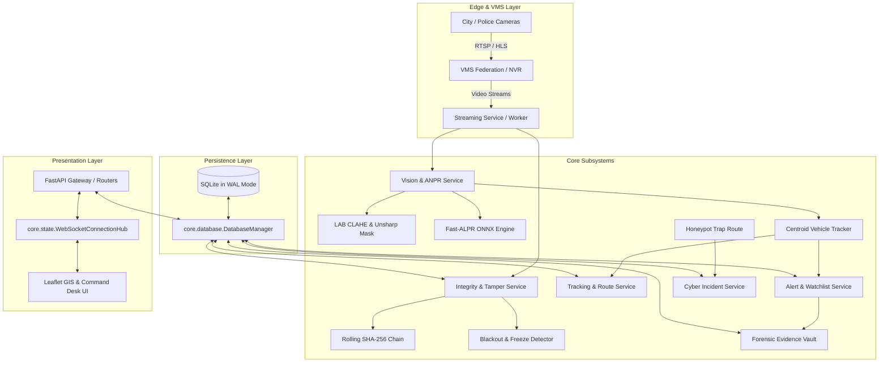

# SentinelShield System Architecture

This document specifies the technical architecture, domain boundaries, data models, concurrency mechanisms, and forensic integrity guarantees of **SentinelShield (Sentinel-X Gujarat)**.

---

## 1. High-Level Architecture

SentinelShield is engineered as a multi-tier, cyber-physical command desk integrating video feeds from legacy CCTV networks across Gujarat with real-time AI vision, cryptographic verification, and spatial intelligence.



---

## 2. Core Infrastructure Layer (`sentinelshield/core/`)

### Database Manager (`core/database.py`)
- **SQLite Write-Ahead Logging (WAL)**: Concurrency is enabled via `PRAGMA journal_mode=WAL;`, which allows concurrent readers while a single writer operates.
- **Busy Timeout & Normal Sync**: Configured with `PRAGMA busy_timeout=10000;` and `PRAGMA synchronous=NORMAL;` to eliminate `database is locked` operational exceptions under heavy concurrent load.
- **Atomic Transactions**: Provided via `db_manager.transaction()` which issues `BEGIN IMMEDIATE;` inside an acquisition lock, automatically rolling back on exceptions.

### Concurrency State Managers (`core/state.py`)
- **`LiveStreamState`**: Manages the current active live camera stream, capture loop state, and cached latest frame with thread-safe `threading.RLock()`.
- **`AIGuardianState`**: Maintains the lifecycle of the background AI daemon, execution cycles, and last observed license plates.
- **`LiveTrackingState`**: Encapsulates camera-specific centroid tracking dictionaries, active vehicle IDs, and inter-frame gray-scale references.
- **`TemporaryRelayState`**: Provides in-memory JPEG buffering for mobile phone camera relay testing.
- **`WebSocketConnectionHub`**: Asyncio-safe hub managing connected operator clients and broadcasting incident messages.

### Security & Session Manager (`core/security.py`)
- Provides token-based authentication with role-based access control (`admin`, `operator`, `police`).
- Session tokens are generated cryptographically using `secrets.token_hex(16)`.

---

## 3. Domain Subsystems (`sentinelshield/modules/`)

### Vision & ANPR Subsystem (`modules/vision/`)
1. **Vehicle Detection (`vehicle_detector.py`)**: Uses Sobel gradient morphology combined with inter-frame motion differencing to classify vehicles (`car`, `bike/activa`, `bus/truck`, `vehicle`).
2. **Deblurring Pipeline (`deblur.py`)**:
   - **Bicubic Upscaling**: Normalizes low-resolution crops to suitable dimensions ($h \ge 90\text{px}, w \ge 220\text{px}$).
   - **LAB-space CLAHE**: Equalizes luminance ($L$) with a clip limit of $3.5$ over an $8 \times 8$ grid.
   - **Unsharp Masking**: Deblurs high-frequency plate edges using Gaussian-weighted subtraction ($1.8 \times \text{sharp} - 0.8 \times \text{blur}$).
   - **Laplacian Sharpness Scoring**: Evaluates focus quality $\text{Var}(\nabla^2 I)$.
3. **ALPR OCR (`alpr_ocr.py`)**: Thread-safe lazy loading of Fast-ALPR ONNX model with fallback to Open-LPR REST API and local PyTesseract OCR.

### Integrity & Forensics Subsystem (`modules/integrity/`)
1. **Rolling SHA-256 Hash Chain (`hash_chain.py`)**: Generates verifiable cryptographic blocks over 3-second intervals:
   $$\text{Hash}_n = \text{SHA256}(\text{Bytes}_n \parallel \text{Hash}_{n-1})$$
   with $\text{Hash}_0 = \text{"GENESIS"}$.
2. **Tamper Detection (`tamper_detector.py`)**:
   - **Blackout Detection**: Flags frames where average intensity across all channels falls below threshold ($\mu \le 8.0$).
   - **Freeze Attack Detection**: Measures mean absolute inter-frame pixel difference. Values $< 1.2$ sustained over $1.2\text{s}$ trigger a freeze attack alert.
3. **Trust Scoring (`service.py`)**: Calculates feed trustworthiness from 0 to 100 based on tamper occurrences and threat confirmations.

### Tracking & Trajectory Subsystem (`modules/tracking/`)
- **Centroid Association (`tracker.py`)**: Associates detected vehicle centroids with active tracks using Euclidean distance thresholding ($d \le 100\text{px}$).
- **Sliding Window Persistence**: Maintains track identities across temporary occlusions (up to $2.5\text{s}$).
- **Route Reconstruction (`service.py`)**: Reconstructs chronological vehicle hops, estimates directional vectors (North, South, East, West), and approximates travel velocity in $\text{km/h}$.

### Alerts & Threat Fusion Subsystem (`modules/alerts/`)
- **Multi-Lingual Localization (`fusion.py`)**: Real-time translation of threat descriptions across English, Hindi, and Gujarati.
- **Alert Deduplication (`service.py`)**: Enforces a 3-minute sliding cooldown window on identical alert signatures per camera feed.

### Cybersecurity Honeypot Subsystem (`modules/cyber/`)
- Exposes decoy ONVIF/RTSP discovery endpoints (`/honeypot`, `/onvif/device_service`) that mimic vulnerable IP cameras, immediately trapping unauthorized scanners and logging attacker telemetry.

### Evidence Vault Subsystem (`modules/evidence/`)
- Packages incident metadata into immutable, SHA-256 fingerprint-sealed JSON evidence artifacts stored in `media/vault/`.
- Computes incident seriousness rank scores ($40 - 99$) prioritizing critical alerts and compromised feeds.

### Digital Twin & Assistant Subsystem (`modules/twin/`)
- **Predictive Risk Heatmaps (`heat.py`)**: Analyzes historical alerts and camera density to compute spatial risk levels (`high`, `medium`, `low`).
- **Natural Language Assistant (`assistant.py`)**: Parses operator intent in natural language and dispatches corresponding UI views.

---

## 4. Database Schema Reference

```
┌────────────────────┬────────────────────────────────────────────────────────────────────────┐
│ Table Name         │ Primary Columns & Data Types                                           │
├────────────────────┼────────────────────────────────────────────────────────────────────────┤
│ cameras            │ id (PK), name, place, lat, lng, source, kind, trust, status, last_note │
│ watchlist          │ id (PK), kind, plate, note, priority                                   │
│ sightings          │ id (PK), plate, camera_id, camera_name, place, city_id, lat, lng, ... │
│ vehicle_detections │ id (PK), camera_id, vehicle_type, tracking_id, plate, confidence, ...  │
│ alerts             │ id (PK), camera_id, kind, title, detail, severity, trust, t, created   │
│ events             │ id (PK), kind, title, camera_id, place, extra, created                 │
│ evidence           │ id (PK), camera_id, sha256, path, created                              │
│ cyber              │ id (PK), kind, detail, camera_id, created, status                      │
│ hashes             │ id (PK AUTO), job_id, t_start, t_end, sha256, prev                     │
│ jobs               │ id (PK), camera_id, video, status, result, created                     │
│ messages           │ id (PK), room, user, role, text, created                               │
│ cities             │ id (PK), name, lat, lng, cameras                                       │
│ areas              │ id (PK), city_id, name, lat, lng, cameras                              │
│ persons            │ id (PK), name, kind, note                                              │
└────────────────────┴────────────────────────────────────────────────────────────────────────┘
```

---

## 5. Frontend Architecture (`sentinelshield/static/`)

The web client is built using modern, dependency-free vanilla JavaScript organized into reactive modules:

```
static/
├── css/
│   └── styles.css              # Dark theme styling, grid layouts, alert cards
├── js/
│   ├── state.js                # Reactive shared state store (SSState)
│   ├── api.js                  # Promise-based REST API fetch client (SSApi)
│   ├── main.js                 # App bootloader, event delegation, window aliases
│   └── modules/
│       ├── auth.js             # Login / session verification
│       ├── registry.js         # Gujarat city & area card navigation
│       ├── live_player.js      # MJPEG video player & freeze-frame controls
│       ├── anpr_scanner.js     # Live frame vehicle/plate scan & deblur gallery
│       ├── vehicle_find.js     # Sighting search & Leaflet route trail
│       ├── map_twin.js         # Digital Twin predictive heatmaps & drone dispatch
│       ├── alerts_threats.js   # Incident table triage (Seen / Done)
│       ├── watchlist.js        # Watchlist CRUD
│       ├── evidence_vault.js   # Evidence package sealing & ranking
│       ├── cyber_tools.js      # Honeypot logs & cyber audit
│       ├── assistant.js        # NLP operator query & speech input
│       └── chat_drawer.js      # WebSocket team room communication
└── index.html                  # Single-page application layout
```
