# SentinelShield (Sentinel-X Gujarat)

<div align="center">


[](https://fastapi.tiangolo.com)
[](https://python.org)
[](https://opencv.org)
[](https://github.com/ankits/fast-alpr)
[](https://sqlite.org)
[](LICENSE)

**Unified CCTV Integration, AI Vision Analytics, Forensic Integrity, Cyber Honeypot, and GIS Command Desk for Smart Gujarat State Security.**

[Key Features](#key-features) • [Architecture](#system-architecture) • [Getting Started](#getting-started) • [API Documentation](#api-reference) • [Agentic Development](#agentic-development)

</div>

---

## 🌟 Overview

Most surveillance software focuses exclusively on narrow video analytics. **SentinelShield** bridges physical security, computer vision, cybersecurity, and digital evidence forensics into a single zero-latency unified command desk.

Designed to scale to **2,00,000+ government cameras** across Gujarat without requiring costly proprietary upgrades, SentinelShield connects directly with existing NVRs/VMSs (Hikvision, Dahua, CP Plus, Milestone, Axis), processes live streams with real-time AI and deblurring, secures feeds with rolling SHA-256 hash chains, detects network intrusions via decoy honeypot traps, and assists law enforcement officers in English, Hindi, and Gujarati.

---

## 🚀 Key Features

### 1. 🔍 Advanced Vision & License Plate Recognition (ANPR)
- **Fast-ALPR ONNX Deep Engine**: Neural network plate localization and OCR running locally with sub-millisecond inference.
- **CCTV Deblurring & Super-Resolution**: Automatic bicubic upscaling, LAB-space CLAHE contrast boosting, unsharp mask sharpening, and Laplacian sharpness scoring for blurry/low-resolution nighttime CCTV frames.
- **Centroid Vehicle Tracking**: Multi-frame vehicle association with a 2.5-second persistence sliding window that tracks trajectories and counts passing vehicles across lanes.
- **Privacy Obfuscation**: In-place Gaussian plate blurring during live previews.

### 2. 🛡️ Forensic Evidence Vault & Anti-Tamper Integrity
- **Rolling SHA-256 Hash Chain**: Computes rolling cryptographic fingerprints for 3-second video segments to ensure footage has not been spliced or modified.
- **Real-Time Tamper Detection**: Optical flow and variance analysis detects feed blackouts, camera obstruction, frozen video attacks, and looped playback.
- **Cryptographic Evidence Sealing**: Packages incident clips into SHA-256 stamped JSON evidence bundles ready for court submission.
- **Incident Seriousness Ranking**: Dynamically calculates incident priority based on severity, threat level, and camera trust scores (0–100).

### 3. 🎯 Cybersecurity Honeypot Traps
- **Decoy Camera Endpoints**: Exposes fake RTSP/ONVIF endpoints (`/honeypot`, `/onvif/device_service`) that capture unauthorized access attempts and log attacker IP fingerprints directly into the central cyber incident registry.

### 4. 🗺️ Gujarat GIS & Digital Twin
- **State-Wide Asset Exploration**: Complete hierarchical registry covering Ahmedabad, Surat, Vadodara, Rajkot, Gandhinagar, Bhavnagar, Jamnagar, Junagadh, Anand, Bharuch, Kutch, Valsad, and state highways.
- **Predictive Crime Risk Heatmaps**: Computes spatial risk concentrations by combining historical incident frequencies with camera density metrics.
- **Suspect Route Reconstruction**: Traces multi-hop vehicle sighting chronologies with estimated travel speed and compass directions.
- **Simulated Drone Dispatch**: Aerial overlay triggers for emergency response dispatching.

### 5. 💬 Real-Time Collaboration & Natural Language Assistant
- **Multi-Lingual Operator Assistant**: Parses queries in natural English, Hindi, and Gujarati (e.g., *"show blacklisted vehicles"*, *"find GJ05SS2026"*).
- **WebSocket Team Room**: Real-time broadcast channel enabling multi-operator coordination during ongoing emergencies.

---

## 🏛️ System Architecture

SentinelShield is structured as a decoupled, race-condition-free modular platform:

```mermaid
flowchart TD
    Client["Web Command Desk (Leaflet / Vanilla JS)"] -->|HTTP / WebSocket| App["FastAPI App Gateway"]
    
    subgraph Core_Layer ["Core Infrastructure Layer"]
        Config["config.py (Settings)"]
        DB[("core/database.py (SQLite WAL Mode)")]
        State["core/state.py (Thread-Safe State & WS Hub)"]
        Auth["core/security.py (Session RBAC)"]
    end
    
    subgraph Domain_Modules ["Domain Subsystems"]
        Vision["modules/vision (Deblur, Fast-ALPR, OCR)"]
        Streaming["modules/streaming (MJPEG Loop, AI Daemon, Jobs)"]
        Tracking["modules/tracking (Centroid Tracker, Routes)"]
        Alerts["modules/alerts (Watchlists, Threat Fusion)"]
        Integrity["modules/integrity (Hash-Chains, Tamper Scoring)"]
        Evidence["modules/evidence (Vault Fingerprinting)"]
        Cyber["modules/cyber (Honeypot Traps)"]
        Twin["modules/twin (Heatmaps, NLP Assistant)"]
        Registry["modules/registry (Gujarat CCTV Estate)"]
        Chat["modules/chat (Team WS Messaging)"]
    end
    
    App --> Config
    App --> DB
    App --> State
    App --> Auth
    
    App --> Vision
    App --> Streaming
    App --> Tracking
    App --> Alerts
    App --> Integrity
    App --> Evidence
    App --> Cyber
    App --> Twin
    App --> Registry
    App --> Chat
    
    Vision --> FastALPR["Fast-ALPR ONNX Engine"]
    Streaming --> VideoWorker["Background Video Worker"]
```



### Module Structure

```
SentinelShield/
├── AGENTS.md                       # Agent instructions & development protocol
├── AGENT_RULES.md                  # Non-negotiable engineering standards
├── ARCHITECTURE.md                 # In-depth architectural documentation
├── PROJECT_MANIFEST.md             # Component & API endpoint catalog
├── README.md                       # Main project overview and getting started
├── TASKS.md                        # Active backlog and roadmap
├── docs/                           # Research papers, blueprints, and briefings
├── scripts/                        # PDF generators and utility scripts
├── sentinelshield/                 # Core application source code
│   ├── app.py                      # Clean FastAPI entrypoint (~65 lines)
│   ├── config.py                   # Central typed settings & directory paths
│   ├── engine.py                   # Re-export compatibility layer
│   ├── gujarat_estate.py           # Estate data compatibility layer
│   ├── core/                       # Core infrastructure
│   │   ├── database.py             # SQLite WAL manager with transaction contexts
│   │   ├── security.py             # RBAC session & token manager
│   │   └── state.py                # Thread-safe states with RLock
│   ├── modules/                    # Isolated domain subsystems
│   │   ├── alerts/                 # Threat fusion, watchlist CRUD, demo triggers
│   │   ├── auth/                   # Login, session verification
│   │   ├── chat/                   # WebSocket team communication
│   │   ├── cyber/                  # Decoy honeypot & incident logging
│   │   ├── evidence/               # Evidence vault sealing & ranking
│   │   ├── integrity/              # SHA-256 rolling chain, tamper detection
│   │   ├── registry/               # Gujarat cities, areas, camera feeds
│   │   ├── relay/                  # Temporary mobile webcam relay test
│   │   ├── streaming/              # MJPEG generator, video job worker, AI daemon
│   │   ├── tracking/               # Centroid tracker, route reconstruction
│   │   ├── twin/                   # Digital twin risk heatmaps, assistant NLP
│   │   └── vision/                 # CLAHE deblur, Fast-ALPR, OCR, ANPR
│   ├── static/                     # Modular frontend assets
│   │   ├── index.html              # Clean single-page application structure
│   │   ├── css/styles.css          # Extracted presentation styles
│   │   └── js/                     # Decoupled JavaScript modules
│   │       ├── api.js              # Unified REST API client
│   │       ├── state.js            # Reactive shared state store
│   │       ├── main.js             # Bootstrap & event delegation
│   │       └── modules/            # Domain view controllers (12 modules)
│   └── tests/                      # Automated test suite
│       └── test_modular_sentinel.py # Comprehensive unit and integration tests
```

---

## ⚡ Getting Started

### Prerequisites
- **Python 3.10+**
- **C++ Compiler / OpenMP** (for OpenCV / Fast-ALPR ONNX inference)
- Recommended: `uv` or Python `venv`

### Installation

1. **Clone the repository**:
   ```bash
   git clone https://github.com/pishundhameliya/SentinelShield.git
   cd SentinelShield/sentinelshield
   ```

2. **Create a virtual environment & install dependencies**:
   ```bash
   python -m venv venv
   # On Windows:
   .\venv\Scripts\activate
   # On Linux/macOS:
   source venv/bin/activate

   pip install -r requirements.txt
   ```

3. **Launch the SentinelShield Command Desk**:
   ```bash
   python app.py
   ```

4. **Access the Web Desk**:
   Open `http://localhost:8080` in your web browser.

### Default Login Accounts

| Role | Username | Password | Access Level |
| :--- | :--- | :--- | :--- |
| **Admin** | `admin` | `admin123` | Full system control, data purge, user management |
| **Operator** | `operator` | `oper123` | Live feeds, ANPR scans, threat validation, vehicle tracking |
| **Police Officer** | `police` | `police123` | Evidence vault, watchlist management, incident triage |

---

## 📖 API Reference

### Core Endpoints

| Method | Endpoint | Description |
| :--- | :--- | :--- |
| `POST` | `/api/login` | Authenticate user and receive session token |
| `GET` | `/api/me` | Fetch active user payload |
| `GET` | `/api/overview` | Fetch central dashboard stats, alerts, and live state |
| `GET` | `/api/cities` | List all Gujarat cities and total camera counts |
| `GET` | `/api/cameras` | Filter cameras by city, area, and ownership |
| `POST` | `/api/anpr/scan-live/{camera_id}` | Run vehicle detection + Fast-ALPR deblurring scan |
| `GET` | `/api/vehicle?plate={plate}` | Search vehicle sightings and watchlist status |
| `GET` | `/api/route?plate={plate}` | Reconstruct suspect vehicle route and speed estimate |
| `POST` | `/api/live/start` | Start live camera MJPEG feed or loop |
| `GET` | `/api/live/stream` | Multi-part MJPEG video stream |
| `POST` | `/api/evidence/{camera_id}` | Seal cryptographic evidence package with SHA-256 fingerprint |
| `GET` | `/api/twin` | Get digital twin heatmap, cyber events, and active drones |
| `GET` | `/honeypot` | Decoy camera trap triggering cyber intrusion alert |
| `WS` | `/ws` | Real-time WebSocket connection for team chat |

---

## 🧪 Running Tests

SentinelShield includes a comprehensive test suite covering all subsystems:

```bash
pytest sentinelshield/tests/test_modular_sentinel.py -v
```

---

## 🤖 Agentic Development

This repository is optimized for autonomous AI coding agents (Antigravity, Claude Code, Cursor, Codex).

- **Strict Root-Cause Debugging**: Read [AGENTS.md](file:///D:/Projects/SentinelShield/AGENTS.md) and [AGENT_RULES.md](file:///D:/Projects/SentinelShield/AGENT_RULES.md) before making modifications.
- **Isolated Domain Boundaries**: All changes should be scoped to their corresponding directory under `sentinelshield/modules/`.
- **Concurrency Invariant**: Always access shared state through re-entrant locks (`threading.RLock`) in `core/state.py` and write to the database via `db_manager.transaction()`.

---

## 📄 License

This project is licensed under the MIT License — see the [LICENSE](LICENSE) file for details.
