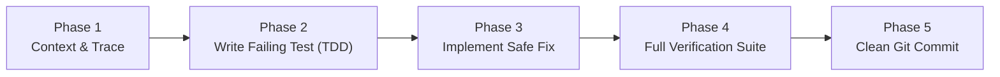

# SentinelShield — Long-Term Engineering & Agent Governance Policy

> **Author**: SentinelShield Core Architecture Team  
> **Target Audience**: AI Agents (Cursor, Claude Code, Gemini/Antigravity, Copilot, Windsurf) & Human Engineers  
> **Status**: Active & Mandatory  

---

## 1. The Constitutional Directives (The North Star)

Every line of code written for SentinelShield must uphold the following foundational pillars:

```text
┌────────────────────────────────────────────────────────────────────────────────────────────────────────┐
│                                 SENTINELSHIELD CONSTITUTIONAL PILLARS                                  │
├───────────────────────────────┬───────────────────────────────────────┬────────────────────────────────┤
│ 1. Defensive Minimalism       │ 2. High-Density Scale (200 Feeds)     │ 3. Forensic Judicial Custody   │
│ • Fix root causes, not hacks  │ • Zero per-frame mallocs in loops     │ • Deterministic Canonical JSON │
│ • Standard library over bloat │ • Multiprocessing GIL bypass          │ • Section 65B / BSA 2023 briefs│
│ • Trust boundaries validated  │ • Client backpressure frame-dropping  │ • Vectorized LSB + CRC32 water │
└───────────────────────────────┴───────────────────────────────────────┴────────────────────────────────┤
```

1. **Simplicity Over Over-Engineering (YAGNI)**: Never add abstractions, layers, or external dependencies unless there is an immediate, concrete requirement.
2. **Defensive Edge Boundaries**: Assume every external input (stream URLs, RTSP sockets, CSV uploads, JSON bodies, WebSocket payloads) is malformed, delayed, or malicious. Validate and sanitize at the ingress layer.
3. **Evidence Over Assertions**: Never claim a bug is fixed, a feature works, or performance improved without providing verifiable output from `python verify.py`.

---

## 2. Non-Negotiable Architectural Invariants

### 🏛️ Invariant A: Domain Segregation & Zero Cross-Domain Leaks
- All application code belongs strictly to one of the **12 domain subsystems** in `sentinelshield/modules/` or `sentinelshield/core/`:
  - `core/`: Database WAL connection manager, thread-safe application state, session security.
  - `modules/vision/`: Detection, deblurring, OCR, ALPR.
  - `modules/integrity/`: Rolling SHA-256 hash chains, zero-allocation tamper pools, LSB watermarks.
  - `modules/evidence/`: Section 65B / BSA 2023 courtroom PDF briefs, deterministic JSON verification.
  - `modules/streaming/`: Multi-process stream worker pool, hardware decode probing, adaptive backpressure.
  - `modules/tracking/`: Centroid multi-frame vehicle tracker, route reconstruction.
  - `modules/alerts/`: Threat fusion, tri-lingual translation (EN/HI/GU), HMAC webhooks.
  - `modules/registry/`: Gujarat CCTV estate registry, transactional CSV importer with coordinate validation.
  - `modules/twin/`: Spatial risk heatmaps, local regex NLP assistant parser.
  - `modules/cyber/`: Fake ONVIF honeypot decoy traps, intrusion ledger.
  - `modules/chat/`: WebSocket connection hub with dead-socket cleanup.
  - `modules/relay/`: Mobile webcam JPEG relay testbed.
  - `modules/auth/`: Timing-safe authentication and RBAC.
- **`app.py` is a composer only**: Never place domain business logic, SQL queries, or complex route handlers inside `app.py`.

---

### 🔒 Invariant B: Thread-Safe State & Database Concurrency
- **Centralized State**: Never create mutable global variables (dicts, lists, counters) in route files or background workers. All shared state lives in `sentinelshield/core/state.py` encapsulated behind `threading.RLock()` or `asyncio.Lock()`.
- **SQLite WAL Protocol**:
  - All database interactions must use `core.database.db_manager`.
  - Every connection must enforce:
    ```sql
    PRAGMA journal_mode=WAL;
    PRAGMA busy_timeout=10000;
    PRAGMA synchronous=NORMAL;
    ```
  - Multi-statement write transactions must use:
    ```python
    with db_manager.transaction() as conn:
        conn.execute(...)
    ```
  - High-frequency time-series inserts must use `db_manager.execute_many(query, records)`.
  - **No SQL String Concatenation**: Parameterized placeholders (`?`) are mandatory for every query without exception.

---

### ⚡ Invariant C: High-Density Streaming (200+ Feeds on Workstation Hardware)
- **Zero Dynamic Allocation in Ingestion Loops**:
  - Ingestion and frame processing loops must never allocate new numpy arrays per frame.
  - Use pre-allocated numpy buffers (`(90, 160, 3)` arrays in `MultiCameraTamperPool`).
- **Multiprocessing Core Partitioning**:
  - Parallel stream decodes are partitioned across dedicated worker processes (`StreamWorkerPool`) matching CPU core topology to bypass the Python GIL.
- **Dynamic Client Backpressure**:
  - Slow network viewers must never slow down ingestion or exhaust server RAM. Intermediate frames are dropped dynamically when client queues lag.
- **Exponential Backoff Auto-Reconnect**:
  - Failed video/RTSP streams must use exponential backoff (`1s -> 2s -> 4s -> 8s -> 16s`) to prevent socket thrashing and thread exhaustion.

---

### ⚖️ Invariant D: Judicial Forensic Integrity (Section 65B / BSA 2023)
- **Deterministic Canonical Serialization**:
  - When computing SHA-256 evidence digests, JSON keys must be sorted and compact: `json.dumps(payload, sort_keys=True, separators=(',', ':'))`.
- **LSB Steganographic Watermarking**:
  - Watermarked frames must include the 256-bit binary payload (Magic `SNTL`, UTC timestamp, camera hash, frame seq, CRC32) embedded in the blue-channel LSB.
- **Courtroom PDF Briefs**:
  - All legal certificates must include standard Section 65B / Section 63 BSA legal declaration clauses, SHA-256 custody seals, and verifiable QR codes.

---

## 3. Agent Lifecycle Protocols (Standard Operating Procedure)

When any AI coding agent receives a task or bug report, it must execute in the following 5 phases:



### Phase 1: Context & Exploration
- Use CostWise MCP tools (`find_symbol`, `read_symbol`, `search_code`, `get_repository_summary`) to locate relevant code before viewing raw files.
- Inspect database table schemas in `docs/architecture/DATABASE_SCHEMA.md` and API specifications in `docs/architecture/API_CATALOG.md`.

### Phase 2: Test-Driven Development (TDD)
- Before writing implementation code, create or update a test in `sentinelshield/tests/test_<name>.py`.
- Run the test to confirm it reproduces the failure (Red).

### Phase 3: Minimal Safe Implementation
- Write the minimum defensive code required to satisfy the test (Green).
- Protect all edge cases: `None` values, empty inputs, invalid types, coordinate boundary overflows.
- Ensure all public functions have strict type annotations (`from __future__ import annotations`) and informative docstrings.

### Phase 4: Full Multi-Tier Verification
- Execute the universal verification command:
  ```bash
  python verify.py
  ```
- All 12 test suites and the 200-stream high-density stress benchmark must pass with exit code `0`.

### Phase 5: Clean Git Hygiene
- Run `git status --short` to ensure no temporary databases, logs, or scratch artifacts remain unstaged.
- Create conventional commits with descriptive multi-line messages (`feat:`, `fix:`, `perf:`, `docs:`, `test:`).

---

## 4. Anti-Pattern Blacklist

| Anti-Pattern | Why It Is Forbidden | Allowed Alternative |
| :--- | :--- | :--- |
| **Monolithic routes in `app.py`** | Creates unmaintainable monolithic files and breaks domain isolation. | Register routes in `modules/<domain>/router.py` and mount in `app.py`. |
| **SQL string formatting (`f"SELECT ... '{val}'"`)** | Causes fatal SQL injection vulnerabilities and breaks query plan caching. | Always use parameterized placeholders: `db_manager.query_rows("SELECT ... ?", val)`. |
| **Bypassing `core/state.py` locks** | Causes race conditions, dict mutations during iteration, and thread crashes. | Always wrap access with `with state_manager._lock:` or dedicated accessor methods. |
| **Per-frame mallocs in stream loops** | Causes Python garbage collection latency spikes during 200-stream ingestion. | Use pre-allocated numpy buffers in `MultiCameraTamperPool`. |
| **Blocking async loops with heavy I/O** | Freezes the FastAPI event loop, dropping WebSocket and HTTP connections. | Offload disk writes or cryptography with `loop.run_in_executor(None, ...)`. |
| **Claiming fixes without verification** | Hallucinates successful fixes and risks pushing broken code. | Always run `python verify.py` and inspect command output. |

---

## 5. Continuous Governance & Evolution

- Any modification to this policy must maintain backward compatibility with legacy scripts (`fetch_31.py`, `import_all_31_cams.py`, `engine.py`, `gujarat_estate.py`).
- All newly added skills must be stored in `.agents/skills/<skill-name>/SKILL.md` with clear YAML frontmatter and operational rules.
