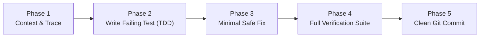

# SentinelShield — Operational Governance Protocol

> **Document Type**: Operational Governance & Architectural Protocol  
> **Authority**: SentinelShield Core Architecture Team  
> **Master Reference**: [`docs/ENGINEERING_POLICY.md`](file:///D:/Projects/SentinelShield/docs/ENGINEERING_POLICY.md)  
> **Target Scope**: All Autonomous AI Agents (Cursor, Claude, Copilot, Windsurf, Gemini/Antigravity) & Human Contributors  
> **Status**: Active & Mandatory  

---

## 1. Constitutional Directives (The 3 Non-Negotiable Pillars)

```text
┌────────────────────────────────────────────────────────────────────────────────────────────────────────┐
│                                 SENTINELSHIELD CONSTITUTIONAL PILLARS                                  │
├───────────────────────────────┬───────────────────────────────────────┬────────────────────────────────┤
│ 1. Defensive Minimalism       │ 2. High-Density Scale (200 Feeds)     │ 3. Forensic Judicial Custody   │
│ • Fix root causes, not hacks  │ • Zero per-frame mallocs in loops     │ • Deterministic Canonical JSON │
│ • Standard library over bloat │ • Multiprocessing GIL bypass          │ • Section 65B / BSA 2023 briefs│
│ • Trust boundaries validated  │ • Client backpressure frame-dropping  │ • Vectorized LSB + CRC32 water │
└───────────────────────────────┴───────────────────────────────────────┴────────────────────────────────┤
```

---

## 2. The 5-Phase Agent Execution Protocol (Standard Operating Procedure)

Every agent interaction—whether adding a feature, refactoring, or fixing a bug—must strictly follow this 5-phase sequential lifecycle:



| Phase | Protocol Name | Mandatory Actions & Rules |
| :--- | :--- | :--- |
| **Phase 1** | **Context First (No Blind Edits)** | • Use CostWise MCP tools (`find_symbol`, `search_code`, `get_repository_summary`) before viewing raw files.<br>• Consult [`SYSTEM_ARCHITECTURE.md`](file:///D:/Projects/SentinelShield/docs/architecture/SYSTEM_ARCHITECTURE.md) and [`DATABASE_SCHEMA.md`](file:///D:/Projects/SentinelShield/docs/architecture/DATABASE_SCHEMA.md). |
| **Phase 2** | **Test-Driven Red-Green Cycle** | • Write a minimal failing test in `sentinelshield/tests/test_<feature>.py` before touching implementation code.<br>• Confirm test failure demonstrates the exact defect or missing requirement. |
| **Phase 3** | **Defensive Implementation** | • Write the minimal code required to pass the test.<br>• Validate all edge boundaries: `None`, empty inputs, type mismatches, out-of-bounds coordinates.<br>• Maintain clean type annotations (`from __future__ import annotations`). |
| **Phase 4** | **Verification Gatekeeper** | • Run the universal test command: `python verify.py`.<br>• Confirm all 12 test suites and the 200-stream stress benchmark exit with code `0`.<br>• **Rule**: Evidence before assertion—never claim success without test output. |
| **Phase 5** | **Hygiene & Git Governance** | • Check `git status --short` to ensure zero leftover scratch files or database artifacts.<br>• Commit with Conventional Commit syntax (`feat:`, `fix:`, `perf:`, `docs:`, `test:`). |

---

## 3. Domain Boundary & Subsystem Governance

Code is strictly segregated into **12 domain subsystems** under [`sentinelshield/modules/`](file:///D:/Projects/SentinelShield/sentinelshield/modules/):

```text
sentinelshield/
├── core/                  # Database WAL manager, thread-safe state, timing-safe auth sessions
├── modules/
│   ├── vision/            # Vehicle detection, CLAHE deblurring, Fast-ALPR, morphological OCR
│   ├── integrity/         # Rolling SHA-256 hash chains, zero-allocation tamper pools, LSB watermarks
│   ├── evidence/          # Section 65B/BSA 2023 courtroom PDF briefs, canonical JSON verification
│   ├── streaming/         # StreamWorkerPool (multiprocess), hw_accel probe, dynamic backpressure
│   ├── tracking/          # Centroid vehicle tracker, route trajectory reconstruction
│   ├── alerts/            # Threat fusion, tri-lingual dispatch (EN/HI/GU), HMAC webhooks
│   ├── registry/          # Gujarat CCTV estate (15 zones), transactional CSV bulk importer
│   ├── twin/              # Spatial risk heatmaps, local regex NLP assistant parser
│   ├── cyber/             # Fake ONVIF/admin honeypot decoy traps, port scan ledger
│   ├── chat/              # WebSocket hub (/ws) with dead-socket cleanup & room persistence
│   ├── relay/             # Temporary mobile phone webcam JPEG relay testbed
│   └── auth/              # Timing-safe session tokens & RBAC verification
└── app.py                 # COMPOSER ONLY — Mounts routers & lifespans, zero domain business logic
```

---

## 4. Concurrency, State & Database Invariants

1. **Thread-Safe State Invariant**:
   - Never create mutable global variables (such as plain dicts or lists) in route files or worker loops.
   - All global state must live in [`core/state.py`](file:///D:/Projects/SentinelShield/sentinelshield/core/state.py) protected by `threading.RLock()` or `asyncio.Lock()`.
2. **Database Access Invariant**:
   - All database operations must use [`core.database.db_manager`](file:///D:/Projects/SentinelShield/sentinelshield/core/database.py).
   - SQLite WAL mode is strictly mandatory: `PRAGMA journal_mode=WAL;`, `PRAGMA busy_timeout=10000;`, `PRAGMA synchronous=NORMAL;`.
   - Multi-statement write transactions must use `with db_manager.transaction() as conn:`.
   - Time-series inserts must use `db_manager.execute_many(query, records)`.
   - Parameterized placeholders (`?`) are mandatory for 100% of queries—**zero SQL string formatting**.

---

## 5. High-Density Streaming Performance Budget (200 Streams)

| Metric / Parameter | Performance Invariant | Enforcement Mechanism |
| :--- | :--- | :--- |
| **Stream Capacity** | **200 Concurrent Feeds** | `StreamWorkerPool` multi-process core partitioning |
| **Aggregate Throughput** | **$>25,000\text{ FPS}$** | Verified via `benchmark_200_streams.py` ($28,471.8\text{ FPS}$) |
| **Per-Frame Latency** | **$<0.05\text{ ms}$** | Verified via `benchmark_200_streams.py` ($0.035\text{ ms}$) |
| **Memory Allocation** | **Zero per-frame mallocs** | `MultiCameraTamperPool` pre-allocated $(90, 160, 3)$ arrays |
| **Network Backpressure** | **Zero RAM queue inflation** | `mjpeg.py` adaptive client frame-dropping |
| **Disconnect Recovery** | **Exponential Backoff** | $1\text{s} \rightarrow 2\text{s} \rightarrow 4\text{s} \rightarrow 8\text{s} \rightarrow 16\text{s}$ auto-reconnect |

---

## 6. Judicial Forensics & Legal Admissibility Invariants

1. **Legal Standards**:
   - **Section 65B(4)** of the Indian Evidence Act, 1872
   - **Section 63** of the Bharatiya Sakshya Adhiniyam (BSA), 2023
2. **Canonical Serialization**:
   - All evidence digests must use sorted keys and compact separators: `json.dumps(payload, sort_keys=True, separators=(',', ':'))`.
3. **LSB Steganographic Watermarking**:
   - Vectorized blue-channel LSB embedding with 256-bit payload (Magic `SNTL`, UTC timestamp, camera hash, sequence number, CRC32 checksum).
4. **Courtroom PDF Briefs**:
   - Built with ReportLab Platypus in [`pdf_builder.py`](file:///D:/Projects/SentinelShield/sentinelshield/modules/evidence/pdf_builder.py), featuring official headers, tamper status, SHA-256 seal, Section 65B clause, and QR codes.

---

## 7. Anti-Pattern Blacklist

- ❌ **Monolithic Code in `app.py` or `engine.py`**: Business logic belongs in `modules/<domain>/service.py`.
- ❌ **Unsafe SQL Formatting**: Writing `f"SELECT * FROM cameras WHERE id='{id}'"` is strictly forbidden.
- ❌ **Bypassing State Locks**: Accessing `_sessions`, `_frame`, or `_camera_tracks` without acquiring locks.
- ❌ **Per-Frame Dynamic Mallocs**: Allocating new numpy frame arrays in 200-camera streaming loops.
- ❌ **Unverified Assertions**: Claiming work is complete without running `python verify.py`.
- ❌ **Blocking Event Loops**: Running blocking I/O or heavy cryptography inside `async def` routes without threadpool offloading (`loop.run_in_executor(None, ...)`).

---

## 8. Verification Matrix & Quality Gatekeeper

Before concluding any work, the agent must execute:

```bash
python verify.py
```

### Current Verification Status (100% PASS):
```text
================================================================================
           SENTINELSHIELD (SENTINEL-X GUJARAT) — VERIFICATION SUITE             
================================================================================
 Discovered Suites : 13 test & benchmark files

 STATUS     | DURATION   | TEST SUITE
 ------------------------------------------------------------------------------
 [PASS]     |  0.408 s   | sentinelshield/tests/benchmark_200_streams.py
 [PASS]     |  0.646 s   | sentinelshield/tests/test_async_evidence_sealing.py
 [PASS]     |  0.678 s   | sentinelshield/tests/test_code_quality_and_lints.py
 [PASS]     |  0.590 s   | sentinelshield/tests/test_database_self_healing.py
 [PASS]     |  0.648 s   | sentinelshield/tests/test_forensic_evidence_pdf_and_watermark.py
 [PASS]     |  0.480 s   | sentinelshield/tests/test_hash_bulk_batch.py
 [PASS]     |  0.683 s   | sentinelshield/tests/test_modular_sentinel.py
 [PASS]     | 16.457 s   | sentinelshield/tests/test_stream_acceleration_and_backpressure.py
 [PASS]     | 13.641 s   | sentinelshield/tests/test_stream_backpressure_stress_challenge.py
 [PASS]     |  0.597 s   | sentinelshield/tests/test_stream_disconnect_challenge.py
 [PASS]     |  0.226 s   | sentinelshield/tests/test_stream_pool.py
 [PASS]     |  0.156 s   | sentinelshield/tests/test_tamper_ring_buffer.py
 [PASS]     |  0.502 s   | sentinelshield/tests/test_webhooks_and_csv_importer.py
 ==============================================================================
 RESULTS: 13 Passed, 0 Failed in 35.71 seconds.
 [ALL PASS] System architecture, scaling, and integrity 100% verified.
```

---

## 9. Backward Compatibility Guarantee

To prevent breaking external integrations and scripts:
- [`engine.py`](file:///D:/Projects/SentinelShield/sentinelshield/engine.py) and [`gujarat_estate.py`](file:///D:/Projects/SentinelShield/sentinelshield/gujarat_estate.py) maintain re-exports of all legacy symbols (`detect_vehicles`, `normalize_plate`, `extract_plate_candidate`, `process_video`, `CITIES`, `DEMO_CAMS`, `sample_points`, etc.).
- Utility scripts [`fetch_31.py`](file:///D:/Projects/SentinelShield/sentinelshield/fetch_31.py) and [`import_all_31_cams.py`](file:///D:/Projects/SentinelShield/sentinelshield/import_all_31_cams.py) remain fully functional and synchronized with live streaming feeds.
