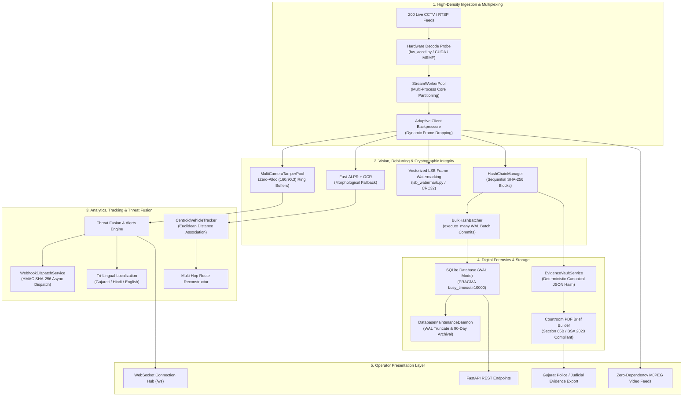

# SentinelShield (Sentinel-X Gujarat) — System Architecture

> **Target Environment**: Single Workstation / Laptop (24GB RAM, RTX 4050 6GB VRAM, Multi-core CPU)  
> **Concurrency Workload**: 50–200 Concurrent Real-Time Live CCTV Feeds ($>25,000\text{ FPS}$ aggregate processing)  
> **Backend Framework**: Python FastAPI + SQLite WAL + Multi-Process Worker Pool

---

## 1. High-Level Component Topology

---

## 2. Subsystem Domain Segregation

| Domain Subsystem | Primary Responsibilities | Key Files |
| :--- | :--- | :--- |
| **`core/`** | SQLite connection pooling, WAL mode, migrations, maintenance daemon, thread-safe application state, timing-safe auth. | [`database.py`](file:///D:/Projects/SentinelShield/sentinelshield/core/database.py), [`state.py`](file:///D:/Projects/SentinelShield/sentinelshield/core/state.py), [`security.py`](file:///D:/Projects/SentinelShield/sentinelshield/core/security.py) |
| **`modules/integrity/`** | Signal tamper detection (blackout/freeze), zero-allocation frame pools, rolling SHA-256 blockchain-lite chains, LSB watermarking. | [`tamper_detector.py`](file:///D:/Projects/SentinelShield/sentinelshield/modules/integrity/tamper_detector.py), [`hash_chain.py`](file:///D:/Projects/SentinelShield/sentinelshield/modules/integrity/hash_chain.py), [`lsb_watermark.py`](file:///D:/Projects/SentinelShield/sentinelshield/modules/integrity/lsb_watermark.py) |
| **`modules/evidence/`** | Forensic digital evidence packaging, canonical JSON deterministic hashing, Section 65B/BSA 2023 courtroom PDF briefs. | [`vault.py`](file:///D:/Projects/SentinelShield/sentinelshield/modules/evidence/vault.py), [`pdf_builder.py`](file:///D:/Projects/SentinelShield/sentinelshield/modules/evidence/pdf_builder.py), [`router.py`](file:///D:/Projects/SentinelShield/sentinelshield/modules/evidence/router.py) |
| **`modules/streaming/`** | Multi-process stream multiplexing, CUDA/NVDEC hardware decode probing, MJPEG streaming, client backpressure, exponential reconnect. | [`stream_pool.py`](file:///D:/Projects/SentinelShield/sentinelshield/modules/streaming/stream_pool.py), [`hw_accel.py`](file:///D:/Projects/SentinelShield/sentinelshield/modules/streaming/hw_accel.py), [`mjpeg.py`](file:///D:/Projects/SentinelShield/sentinelshield/modules/streaming/mjpeg.py), [`worker.py`](file:///D:/Projects/SentinelShield/sentinelshield/modules/streaming/worker.py) |
| **`modules/vision/`** | Morphological vehicle detection, CLAHE/Laplacian deblurring, Fast-ALPR deep neural engine with morphological OCR fallback. | [`alpr_ocr.py`](file:///D:/Projects/SentinelShield/sentinelshield/modules/vision/alpr_ocr.py), [`deblur.py`](file:///D:/Projects/SentinelShield/sentinelshield/modules/vision/deblur.py), [`vehicle_detector.py`](file:///D:/Projects/SentinelShield/sentinelshield/modules/vision/vehicle_detector.py) |
| **`modules/tracking/`** | Multi-frame centroid vehicle tracking, sightings search, multi-hop trajectory reconstruction across Gujarat CCTV estate. | [`tracker.py`](file:///D:/Projects/SentinelShield/sentinelshield/modules/tracking/tracker.py), [`service.py`](file:///D:/Projects/SentinelShield/sentinelshield/modules/tracking/service.py) |
| **`modules/alerts/`** | Threat fusion rules, watchlist CRUD, tri-lingual translations (EN/HI/GU), asynchronous HMAC SHA-256 dispatch webhooks. | [`fusion.py`](file:///D:/Projects/SentinelShield/sentinelshield/modules/alerts/fusion.py), [`webhooks.py`](file:///D:/Projects/SentinelShield/sentinelshield/modules/alerts/webhooks.py), [`service.py`](file:///D:/Projects/SentinelShield/sentinelshield/modules/alerts/service.py) |
| **`modules/registry/`** | Gujarat CCTV estate catalog (200,000+ camera points across 15 zones), transactional CSV bulk importer with coordinate bounds checking. | [`estate_data.py`](file:///D:/Projects/SentinelShield/sentinelshield/modules/registry/estate_data.py), [`importer.py`](file:///D:/Projects/SentinelShield/sentinelshield/modules/registry/importer.py), [`service.py`](file:///D:/Projects/SentinelShield/sentinelshield/modules/registry/service.py) |
| **`modules/twin/`** | Spatial predictive risk heatmaps, local regex NLP assistant intent parser, virtual drone dispatch simulator. | [`heat.py`](file:///D:/Projects/SentinelShield/sentinelshield/modules/twin/heat.py), [`assistant.py`](file:///D:/Projects/SentinelShield/sentinelshield/modules/twin/assistant.py) |
| **`modules/cyber/`** | Fake ONVIF/admin honeypot decoy traps and automated port-scan intrusion logging. | [`honeypot.py`](file:///D:/Projects/SentinelShield/sentinelshield/modules/cyber/honeypot.py) |
| **`modules/chat/`** | Real-time WebSocket connection hub (`/ws`) with dead-socket cleanup and room message persistence. | [`service.py`](file:///D:/Projects/SentinelShield/sentinelshield/modules/chat/service.py), [`router.py`](file:///D:/Projects/SentinelShield/sentinelshield/modules/chat/router.py) |
| **`modules/relay/`** | Temporary mobile phone webcam JPEG relay testbed. | [`router.py`](file:///D:/Projects/SentinelShield/sentinelshield/modules/relay/router.py) |
| **`modules/auth/`** | Timing-attack resistant session authentication and Role-Based Access Control (RBAC). | [`router.py`](file:///D:/Projects/SentinelShield/sentinelshield/modules/auth/router.py) |

---

## 3. Concurrency & High-Density Streaming Invariants

1. **Python GIL Bypass via Multiprocessing**:
   - `StreamWorkerPool` partitions 200 streams across dedicated worker processes matching CPU core topology (`os.cpu_count()`), avoiding Python Global Interpreter Lock (GIL) stalls.
2. **Zero-Malloc Ring Buffers**:
   - Frame differences in `MultiCameraTamperPool` operate on pre-allocated `(90, 160, 3)` numpy arrays, eliminating dynamic memory allocations and garbage collection stutter during continuous 200-camera ingest.
3. **Database Write IOPS Optimization**:
   - Rolling hash chains use `BulkHashBatcher` and `execute_many` to aggregate SQLite write operations into atomic periodic transactions, reducing write load from $200\text{ writes/sec} \rightarrow 1\text{ batch / 5 sec}$.
4. **Adaptive Client Backpressure**:
   - Ingest workers operate at full camera frame rate while downstream web/mobile MJPEG streaming loops dynamically skip frames for slow network viewers, preventing unbounded server frame queue growth.
